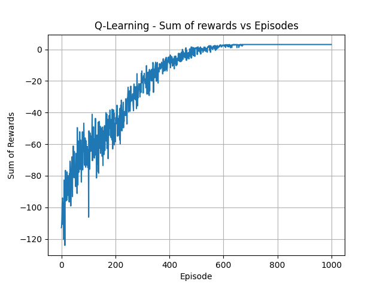

# Multi-Agent Search and Rescue using a Central Control Agent with Tabular Q-Learning

<hr>

## Getting Started

### Prerequisites

To run the code, you will need Python 3.10 or higher and pip.

### Cloning the repo

Clone the repo and setup the environment with:

```
git clone https://github.com/andrew-farrell-101/search-and-rescue
cd search-and-rescue
python -m venv .env
source .env/bin/activate
pip install -r requirements.txt
pip install -e .
```

If you are on Windows, try activating the virtual environment using:

```
source .env/Scripts/activate
```

### Running the program

Run the program using the following command:

```
python main.py
```

The output of the program is a graph of the sum of rewards over the episodes.

